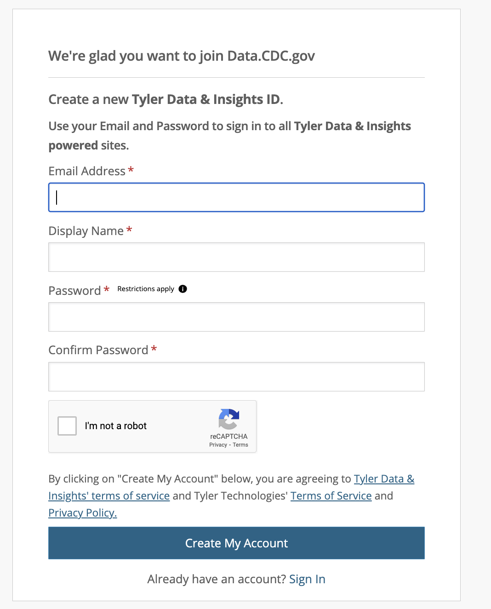
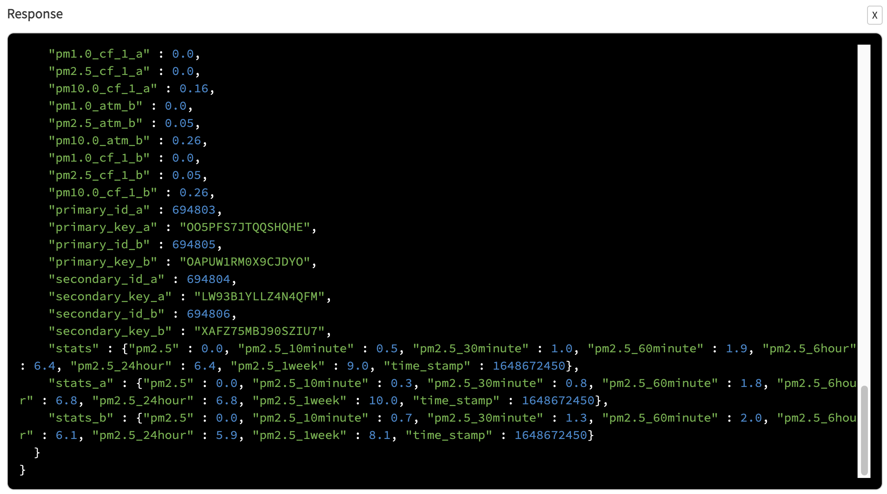
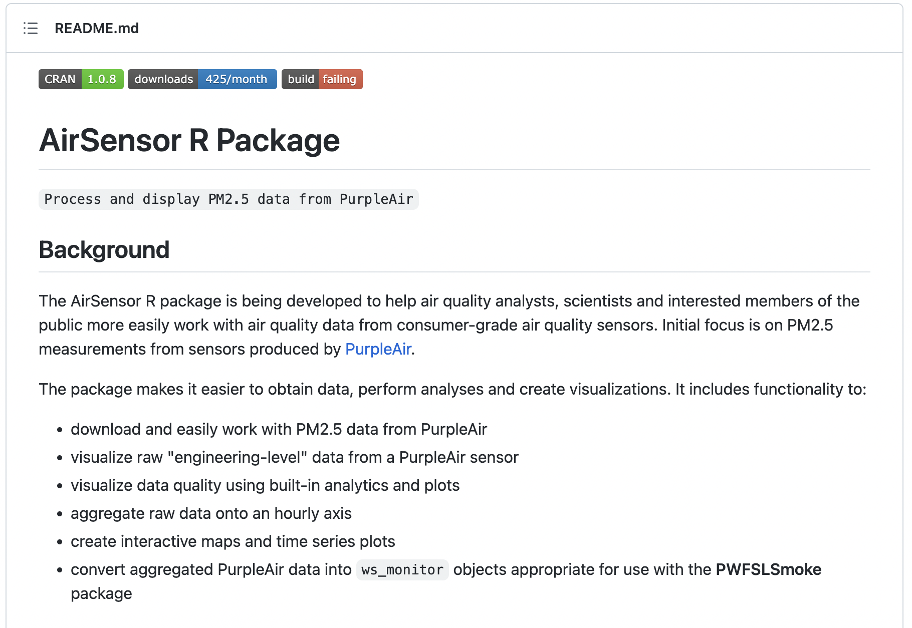

# Agenda

- Introductions
- What is an API?
- CDC API
- PurpleAir API
- Conclusion
- References

# 1. Introductions

## My background

* Education: 
  + Ph.D., Sociology, University of Washington, 2017
  + M.A., Sociology,  University of North Carolina at Chapel Hill, 2012
  + B.A., Sociology, Princeton University, 2009
* Career 
  + 2016: Civic Technology Fellow, Microsoft
  + 2017 – 2018: Postdoctoral Researcher, Bocconi University
  + 2018 – 2020: Data Scientist, MAANA (acquired by SparkCognition)
  + 2020 – Present: Principal, Atlas Analytics
  + 2021 – 2021: Senior Policy Advisor, Office of Harris County Judge Lina Hidalgo
  + 2021 – 2021: Lecturer, Department of Sociology, University of Washington
  + 2021 – present: Data Scientist, Karna

# Personal interests

* My research focuses on
  + Methodology
  + Data-fusion models
  + Text as data
* Substantive interests: 
  + Social Demography (e.g., migration)
  + Social Media 
  + Disaster Response
  + Homelessness
  + Health Policy (e.g., COVID-19 Responses)

# What do I do?

:::::::::::::: {.columns}
::: {.column}

* I try to break down problems into programmable solutions
  + Coding
* Experienced teacher of analytics and analytic scaffolding
* I enjoy playing/watching sports (soccer, basketball, football, and the 2017 World Series Champions, Houston Astros), traveling, movies, and reading.
:::

::: {.column}
{height=800px; width=600px}
:::
::::::::::::

# 2. What is an API?

* adapted from [Amazon Web Services](https://aws.amazon.com/what-is/api/)

Application Programming Interface (API)

> "APIs are mechanisms that enable two software components to communicate with each other using a set of definitions and protocols. For example, the weather bureau’s software system contains daily weather data. The weather app on your phone 'talks' to this system via APIs and shows you daily weather updates on your phone." - [Amazon Web Services](https://aws.amazon.com/what-is/api/)

In plain English, an API is a standard way for developers to communicate with software applications to request and send data. An API is composed of 

1. formal syntax that governs communication between software and
2. the software itself

# TL;DR

* What:
  + APIs are a way for devices and developers to programmatically exchange information
  + APIs exist for nearly every service
* Why:
  + Use APIs for automated data management and bespoke software solutions
* When:
  + If a software package exists to access a service, it is using the API
    + and beats writing your own code
  + If the service has an API and no package, that's the next tier   
  + Bottom rung is no API, learn to scrape.
  + Garbage tier is no API and anti-scrape protection (aka FUN)

# What is an API?

{height=1500px; width=1200px}

# What is an API?

* A company stores its data in a relational database
* The company uses a web server to display website content that surfaces data found in the database
* The company allows users on the internet to programmatically receive (and in some cases send) data from (to) the database via the API

# Why use an API (Business Case)

* adapted from: [The Enterprisers Project](https://enterprisersproject.com/article/2018/11/how-explain-apis-plain-english?sc_cid=701f2000000tpAgAAI&page=0%2C1%2C0)

1. APIs cut down on development time and costs

"We live in the world of API economy, where new software is built by leveraging many different commercial or open source software components," says [Bhanu] Singh [VP of Engineering] of OpsRamp. "For example, Uber uses a variety of software systems for things like payment, location, maps, and traffic, all of which rely on APIs to communicate."

# Why use an API (Business Case)

2. APIs reduce complexity

"Without APIs, developers would need to have intimate knowledge of the internal workings of an application to be able to extend its functionality," says [Glenn] Sullivan [co-founder] at SnapRoute. "Instead, APIs give developers a way of collaborating to build more intricate systems of applications without having to work for the same company or even know each other

# Why use an API (Business Case)

3. APIs make everything more programmable.

APIs have helped enable the automation boom in the software pipeline and elsewhere in the IT portfolio, for example. And again, in doing so, they reduce manual, repetitive, and often costly effort.

# Why use an API (Research Case)

* APIs encourage innovation and collaboration by allowing stakeholders to easily and securely access data
* APIs introduce good data management practices and reduce the risk of reputational damage from inaccurate data

# How do I use APIs?

* In my work, I use APIs to connect disparate streams of data and build microservices for various solutions
  + Fanar, abstracted as the "Traveling Salesman" problem
* For fun, applications for analyzing tweets of politicians, sports betting, etc.

# How can you use APIs?

* I'm open to suggestions
* What I envisioned today, was two different types of data that have public use cases
  + Getting open data from the CDC
    + Specifically, time series mortality data
  + Getting environmental health data from PurpleAir
    + geospatial and time series data on air quality/conditions

# API Types

* SOAP APIs 
  + These APIs use Simple Object Access Protocol. Client and server exchange messages using XML. 
  + This is a less flexible API that was more popular in the past.
* RPC APIs
  + These APIs are called Remote Procedure Calls. 
  + The client executes a function (or procedure) on the server, and the server sends the output back to the client.

# API Types

* WebSocket APIs
  + WebSocket API is another modern web API development that uses JSON objects to pass data. 
  + A WebSocket API supports two-way communication between client apps and the server. 
    + The server can send callback messages to connected clients, making it more efficient than REST API.
* REST APIs
  + These are the most popular and flexible APIs found on the web today. 
  + The client sends requests to the server as data. 
  + The server uses this client input to execute internal functions and returns output data back to the client. 

# What is JSON?

https://www.json.org/json-en.html

JSON (JavaScript Object Notation) is a lightweight data-interchange format. 

* It is easy for humans to read and write. It is easy for machines to parse and generate. 
* It is based on a subset of the JavaScript Programming Language Standard ECMA-262 3rd Edition - December 1999. 
  + JSON is a text format that is completely language independent but uses conventions that are familiar to programmers of the C-family of languages, including C, C++, C#, Java, JavaScript, Perl, Python, and many others
  
# What is JSON?

```{r install, warning=FALSE, eval=TRUE, include=FALSE}
#' Uncomment the below code to install all relevant packages
#' Run only once. 
options(scipen=999)
# source("code/install.R")
```

```{r json_example1, warning=FALSE, eval=TRUE}
#'from:  https://cran.r-project.org/web/packages/jsonlite/vignettes/json-aaquickstart.html
library(jsonlite)
json <-
'[
  {"Name" : "Mario", "Age" : 32, "Occupation" : "Plumber"}, 
  {"Name" : "Peach", "Age" : 21, "Occupation" : "Princess"},
  {},
  {"Name" : "Bowser", "Occupation" : "Koopa"}
]'

prettify(json, indent = 4)

json_df <- fromJSON(json)
```

# What are REST APIs?

REST stands for Representational State Transfer.

* REST defines a set of functions like GET, PUT, DELETE, etc. that clients can use to access server data. 
  + Clients and servers exchange data using HTTP.
* The main feature of REST API is statelessness.
  + Statelessness means that servers do not save client data between requests. 
* Client requests to the server are similar to URLs you type in your browser to visit a website. 
* The response from the server is plain data, without the typical graphical rendering of a web page.  
  
# What are the benefits of REST APIs?

REST APIs offer four main benefits:

1. Integration 
  + APIs are used to integrate new applications with existing software systems. This increases development speed because each functionality doesn’t have to be written from scratch. You can use APIs to leverage existing code.
2. Innovation 
  + Entire industries can change with the arrival of a new app. Businesses need to respond quickly and support the rapid deployment of innovative services. They can do this by making changes at the API level without having to re-write the whole code.
  
# What are the benefits of REST APIs?

3. Expansion
  + APIs present a unique opportunity for businesses to meet their clients’ needs across different platforms.
    + For example, maps API allows map information integration via websites, Android, iOS, etc.
    + Any business can give similar access to their internal databases by using free or paid APIs.
4. Ease of maintenance
  + The API acts as a gateway between two systems.
  + Each system is obliged to make internal changes so that the API is not impacted.
    + This way, any future code changes by one party do not impact the other party.

# How to use an API?

The steps to implement a new API include:

* Obtaining an API key
  + This is done by creating a verified account with the API provider.
  + **API keys are like your username/password and should be protected accordingly**
* Set up an HTTP API client
  + This tool allows you to structure API requests easily using the API keys received.
  + If you don’t have an API client, you can try to structure the request yourself in your browser by referring to the API documentation.

* Once you are comfortable with the new API syntax, you can start using it in your code.
* **API keys are like your username/password and should be protected accordingly**

# Where can I find new APIs?

New web APIs can be found on API marketplaces and API directories. 

* API marketplaces are open platforms where anyone can list an API for sale. 
* API directories are controlled repositories regulated by the directory owner.
* Expert API designers may assess and test a new API before adding it to their directory.  

# Some popular API websites include:

* Rapid API
  + The largest global API market with over 10,000 public APIs and 1 million active developers on site. RapidAPI allows users to test APIs directly on the platform before committing to purchase.
* Public APIs
  + The platform groups remote APIs into 40 niche categories, making it easier to browse and find the right one to meet your needs.
* APIForThat and APIList
  + Both these websites have lists of 500+ web APIs, along with in-depth information on how to use them.

# 3. CDC API
- Open Data Introduction
- CDC API Examples

# Open Data

* "Open data is data that is openly accessible, exploitable, editable and shared by anyone for any purpose, even commercially" - [Wikipedia](https://en.wikipedia.org/wiki/Open_data)

Socrata, acquired by Tyler Technologies in 2018, has an "Open Data API [which] allows you to programmatically access a wealth of open data resources from governments, non-profits, and NGOs around the world." - [Socrata](https://dev.socrata.com/)

* The CDC shares open data on a variety of subjects, including mortality, on Socrata

# Socrata

* Why Use API Keys?
  + Access Socrata APIs without the risk of embedding your username and password in scripts or code
  + Users on domains that require SSO (and thus without passwords) can access Socrata APIs
  + Create individual keys for different apps or jobs so that if any one needs to be revoked or rotated, other apps are unaffected
  + Change your account password without disrupting apps or rotate API keys without disrupting logins

https://socrataapikeys.docs.apiary.io/#introduction/why-use-api-keys?

**Wait a second! Authentication is only necessary when accessing datasets that have been marked as private or when making write requests (PUT, POST, and DELETE). For reading datasets that have not been marked as private, simply use an application token.**

https://dev.socrata.com/docs/authentication.html

#  CDC API Introduction

* https://data.cdc.gov/signup

{height=1000px; width=800px}

#  CDC API Introduction

* https://support.socrata.com/hc/en-us/articles/210138558-Generating-an-App-Token

{height=1000px; width=800px}

#  CDC API Introduction

* https://support.socrata.com/hc/en-us/articles/210138558-Generating-an-App-Token

{height=1000px; width=800px}

# CDC API Examples

```{r rsocrata_setup, warning=F, message=F, eval=TRUE}
library(yaml)
library(plyr)
library(dplyr)
library(readr)
library(RSocrata)
library(here)
```

# CDC API Examples

* will only run if you have an appropriately formatted file, `credentials/socrata_app_credentials.yml`, with valid CDC API credentials
* see `credentials/example_socrata_app_credentials.yml` for the 3 essential fields in the .yml file

```{r socrata, warning=F, message=F, eval=TRUE}
 #' will only run if you have an appropriately formatted file,
 #' `credentials/socrata_app_credentials.yml` with valid CDC API credential
socrata_app_credentials <- yaml.load_file(here("credentials/socrata_app_credentials.yml"))

#' Yearly Counts of Deaths by State and Select Causes, 1999-2017
#' https://data.cdc.gov/NCHS/NCHS-Leading-Causes-of-Death-United-States/bi63-dtpu
yearly_deaths_by_state_1999_2017 <- read.socrata(
  "https://data.cdc.gov/resource/bi63-dtpu.json",
  app_token = socrata_app_credentials$app_token,
  email = socrata_app_credentials$email,
  password  = socrata_app_credentials$password
)
```

# CDC API Examples

```{r socrata_glimpse, warning=F, message=F, eval=TRUE}
glimpse(yearly_deaths_by_state_1999_2017)
```

# CDC API Examples

https://data.cdc.gov/resource/bi63-dtpu.json

{height=1000px; width=800px}

# CDC API Examples

* will only run if you have an appropriately formatted file, `credentials/socrata_app_credentials.yml`, with valid CDC API credentials

```{r source_nchs_mortality, warning=F, message=F, eval=TRUE}
#' will only run if you have an appropriately formatted file, 
#' `credentials/socrata_app_credentials.yml`, with valid CDC API credentials
source(here("code", "01_get_nchs_mortality.R"))
```

# CDC API Examples

```{r us_deaths_time_series_prep, warning=F, message=F, eval=TRUE}
library(lubridate)
library(scales)
library(ggplot2)
yearly_deaths_by_state_1999_2022$all_deaths <- as.numeric(yearly_deaths_by_state_1999_2022$all_deaths)
yearly_deaths_by_state_1999_2022$year <- ymd(paste0(yearly_deaths_by_state_1999_2022$year, "01-01"))
end_date <- ymd("2021-01-01")
start_date <- ymd("1999-01-01")
us_deaths_time_series <- ggplot(data = yearly_deaths_by_state_1999_2022 %>% 
               filter(state_name=="United States", year<ymd("2022-01-01"))) +
  geom_point(aes(x = year, y = all_deaths, color="darkred", size=1.5)) + 
  geom_vline(xintercept = ymd("2019-12-01"), linetype="dashed", 
             color = "black", size=1) +  
  scale_y_continuous(labels=comma) +
  scale_x_date("", breaks = date_breaks("2 year"),
               limits = c(start_date, end_date),
               labels = date_format(format = "%Y")) + 
  theme(legend.position="none") + 
  labs(x = "Date", y = "Total Deaths",
       title = "US Total Deaths over Time: 1999-2021") +
  annotate(x=ymd("2019-12-01"),y=+Inf,label="COVID-19",vjust=1,geom="label")
```

# CDC API Examples

```{r us_deaths_time_series_plot, warning=F, message=F, eval=TRUE}
print(us_deaths_time_series)
ggsave(here("output/us_deaths_time_series.png"),
       us_deaths_time_series, width=10.67, height=6, dpi=120)
```

# 4. PurpleAir

- Air Pollution Introduction
- PurpleAir Introduction
- PurpleAir API Introduction
- R's AirSensor Package
  + Getting the data
  + Explore the pas object
  + Explore the pat data
  + Working with air sensor data


# Air Pollution Introduction

* from: The [World Health Organization](https://www.who.int/health-topics/air-pollution#tab=tab_1)

* Air pollution kills an estimated seven million people worldwide every year.
  + WHO data shows that almost all of the global population (99%) breathe air that exceeds WHO guideline limits containing high levels of pollutants, with low- and middle-income countries suffering from the highest exposures.
* From smog hanging over cities to smoke inside the home, air pollution poses a major threat to health and climate.
  + The combined effects of ambient (outdoor) and household air pollution cause millions of premature deaths every year
    + largely as a result of increased mortality from stroke, heart disease, chronic obstructive pulmonary disease, lung cancer and acute respiratory infections.

# Air Pollution Introduction

from: [Harvard School of Public Health](https://www.hsph.harvard.edu/c-change/news/fossil-fuel-air-pollution-responsible-for-1-in-5-deaths-worldwide/)

{height=1500px; width=1200px}


# Air Pollution Introduction

* [The effects of increased pollution on COVID-19 cases and deaths](https://www.ncbi.nlm.nih.gov/pmc/articles/PMC7899033/)


from: [Harvard School of Public Health](https://www.hsph.harvard.edu/news/hsph-in-the-news/air-pollution-linked-with-higher-covid-19-death-rates/)

{height=1500px; width=1200px}

# Air Pollution Introduction

[Tyler Cowen on Bloomberg](https://www.bloomberg.com/opinion/articles/2021-03-10/air-pollution-kills-far-more-people-than-covid-ever-will)

{height=1500px; width=1200px}

# Air Pollution Introduction

Houston Chronicle: [Houston’s dangerous concrete plants are mostly in communities of color. Residents are fighting back.](https://www.houstonchronicle.com/news/houston-texas/environment/article/Houston-s-dangerous-concrete-plants-are-mostly-17067357.php)

{height=1500px; width=1200px}

# Air Pollution Introduction

[Pollution Control Services Department](https://pcs.harriscountytx.gov/Pages/default.aspx)

{height=1500px; width=1200px}

# Air Pollution Introduction

[Mobile Monitoring Data](https://pcs.harriscountytx.gov/Pages/MobileMonitoringData.aspx)

{height=1500px; width=1200px}

# PurpleAir Introduction

* PurpleAir is a crowdsourced air monitoring service
* Anyone can buy and install a purple air air quality sensor and hook it up to the larger system to improve monitoring your own air quality
  + also help others monitor their air quality too!

# PurpleAir Introduction

[NBC News](https://www.nbcnews.com/tech/tech-news/high-tech-california-relies-startup-utah-see-how-smoky-its-n1074906)

{height=1500px; width=1200px}

# PurpleAir Introduction

{height=400px; width=300px}

# PurpleAir Introduction

https://www2.purpleair.com/pages/install

{height=1500px; width=1200px}

# PurpleAir Introduction

https://www2.purpleair.com/community/faq#hc-how-do-purpleair-sensors-work

{height=1500px; width=1200px}

# PurpleAir Introduction

https://www2.purpleair.com/community/faq#hc-how-do-purpleair-sensors-work

{height=1500px; width=1200px}

# PurpleAir Introduction

https://map.purpleair.com/1/mAQI/a10/p604800/cC0#9.72/29.785/-95.3946

{height=1000px; width=800px}

# PurpleAir API Introduction

* https://community.purpleair.com/t/making-api-calls-with-the-purpleair-api/180
* https://api.purpleair.com/#api-sensors-get-sensor-data
* will only run if you have an appropriately formatted file, `credentials/purpleair_api_credentials.yml`, with valid PurpleAir API credentials
* see `credentials/example_purpleair_api_credentials.yml` for the 2 essential fields in the .yml file

```{r purpleair_api_manual, warning=F, message=F, eval=TRUE}
#' will only run if you have an appropriately formatted file,
#' `credentials/purpleair_api_credentials.yml`, with valid PurpleAir API credentials
require(httr)

purpleair_api_credentials <- yaml.load_file(here("credentials/purpleair_api_credentials.yml"))

headers <- c(
  `X-API-Key` = purpleair_api_credentials$read_key
)

base_url <- "https://api.purpleair.com/v1/sensors/"
# sensor <- "48545" # Museum District, Houston, Texas
sensor <- "25999" # Villages Of Bridgestone, Spring, TX,
sensor_url <- paste0(base_url, sensor)

result <- httr::GET(url = sensor_url, httr::add_headers(.headers=headers))
```

# PurpleAir API Introduction

```{r purpleair_api_result, warning=F, message=F, eval=TRUE}
result
```

# PurpleAir API Introduction

```{r purpleair_api_manual2, warning=F, message=F, eval=TRUE}
names(content(result))
length(names(content(result)$sensor))
names(content(result)$sensor)[1:20]
```

# PurpleAir API Introduction

{height=1500px; width=1200px}   

# PurpleAir API Introduction

{height=1500px; width=1200px}   

# PurpleAir API Introduction

```{r purpleair_api_manual3, warning=F, message=F, eval=TRUE}
content(result)$sensor$stats
```

# Air Quality Index

https://www.airnow.gov/aqi/aqi-basics/

{height=1500px; width=1200px}   

# R's AirSensor Package

https://github.com/MazamaScience/AirSensor

{height=1000px; width=800px}   

# R's AirSensor Package

* The goal of this section is to demonstrate the use of the **AirSensor** package to explore the smoke impacts of the December 2019 - January 2020 fires and smoke in Australia. 
* This section demonstrates "reproducible research" in that no pre-generated files are needed
  + Raw data from `PurpleAir` will be downloaded and processed when this script is first run.
* In this section, we will use the term "sensor" to refer to consumer-grade, PurpleAir air quality sensors sampling at a high time resolution. 
* The term "monitor" will refer to professional-grade, typically government managed 
monitors with hourly data.

# R's AirSensor Package

The **AirSensor** package has three data models:

* _pas_ (**P**urple**A**ir **S**ynoptic) objects contain snapshots of multiple PA sensors and can be used to make maps.
* _pat_ (**P**urple**A**ir **T**imeseries) objects contain high resolution data for a single sensor.
* _airsensor_ objects contain PA timeseries data that has been quality controlled and aggregated to an hourly time axis.

# R's AirSensor Package

Think about the following questions: 

**What type of `AirSensor` data do we need to look at which locations have a moderate to unhealthy 30-minute air quality rating in Texas?**

**What type of `AirSensor` data do we need to check air quality recorded by a sensor named "Royal Oaks Houston Tx - Outside" between 01-01-2020 and 01-15-2020?**

# R's AirSensor Package

Install and load relevant packages: 

* [`tidyverse`](https://dplyr.tidyverse.org/) for data wrangling and plotting
* [`PWFSLSmoke`](https://cran.r-project.org/web/packages/PWFSLSmoke/vignettes/PWFSLSmoke.html) for USFS monitor data access and plotting
* [`AirSensor`](https://github.com/MazamaScience/AirSensor) for PurpleAir sensor data access and plotting
* [`MazamaSpatialUtils`](https://github.com/MazamaScience/MazamaSpatialUtils) for spatial data download and utility functions
* [`AirMonitorPlots`](https://github.com/MazamaScience/AirMonitorPlots) for advanced plots for monitors.

# R's AirSensor Package

Note that package `AirMonitorPlots` might not yet be available on CRAN. To install, try the `devtools` package (see `code/install.R`)

```{r purpleair_setup, warning=F, message=F, eval=TRUE}
#' load all the packages
library(PWFSLSmoke)
library(AirSensor)
library(AirMonitorPlots)
library(MazamaSpatialUtils)
```

# Getting the data

## set up a local archive folder
The `AirSensor` package needs to know where processed data will live. For this report, we will specify a local `archiveBaseDir` where downloaded and processed data will live. 

# Getting the data

```{r get_data, warning=F, message=F, eval=TRUE}
#' assign a name to the new local folder
archiveBaseDir <- here("data", "Australia_on_fire")

#' check if the same-named folder exists
#' if a same-named folder exists, print the warning
#' if no same-named folder, create the folder
if (file.exists(archiveBaseDir)) {
 cat("The folder already exists")
} else {
 dir.create(archiveBaseDir)
}

#' set the package base directory to an archive of pre-generated data files 
setArchiveBaseDir(archiveBaseDir)
```

# Load synoptic data for Australia

We will use the `pas_createNew()` function to create a *pas* object containing all the spatial metadata associated with purple air monitors in Australia.

To create a new `pas` object you must first properly initialize the `MazamaSpatialUtils` package.

```{r load_australia_data, warning=F, message=F, eval=TRUE}
#' set package data directory
#' install required spatial data
#' initialize the package

filePath_pas <- file.path(archiveBaseDir, "pas_au.rda")
setSpatialDataDir(archiveBaseDir)
installSpatialData('NaturalEarthAdm1')
installSpatialData("CA_AirBasins")
setSpatialDataDir(archiveBaseDir)
initializeMazamaSpatialUtils() 
```

# Load synoptic data for Australia

* Now we create the `pas` object and save it into an .rda file
  + this can take up to a minute to process 

```{r create_pas_au, warning=F, message=F, eval=TRUE}
#' Download, parse and enhance synoptic data from PurpleAir
#' and return the results as a useful tibble with class pa_synoptic
# pas_au <- pas_createNew(countryCodes = "AU", includePWFSL = TRUE)

#' saving and loading the downloaded local file
#' save the synoptic data into an .rda file
# save(pas_au, file = here("data", "pas_au.rda"))

#' load data from the .rda file
pas_au <- get(load(here("data", "pas_au.rda")))
```

# Load synoptic data for Australia

A `pas` object is a dataframe that contains metadata and PM 2.5 averages for many purple air sensors in a designated region. Each `pas` object can be filtered and edited to retain whichever collection of sensors the analyst desires based on location, state, name, etc.

It is important to note that the data averages in the pas object – the numeric values for PM2.5 or temperature or humidity – are current at the time that the pas is created. pas objects can be used to quickly explore the spatial distribution of PurpleAir sensors and display some then-current values but should not be used for detailed analysis.

# Load synoptic data for United States

**Create a `pas` object with current data in US. Save this `pas` file to your computer for later use.**

```{r pas_us, warning=F, message=F, eval=TRUE}
# pas_us <- pas_createNew(countryCodes = "US")
# pas_tx <- pas_us %>% pas_filter(stateCode=="TX")

#' saving and loading the downloaded local file
#' load data from the .rda file
# save(pas_us, file = here("data", "pas_us.rda"))
# save(pas_tx, file = here("data", "pas_tx.rda"))
pas_us <- get(load(here("data", "pas_us.rda")))
pas_tx <- get(load(here("data", "pas_tx.rda")))
```

# View a *pas* map

We can view the locations of each sensor and the AQI (Air Quality Index) maxima (when the pas was created) using the pas_leaflet() function.
```{r pas_au_leaflet, warning=F, message=F, eval=TRUE}
pas_leaflet(pas_au)
```

# View a *pas* map

```{r pas_tx_leaflet, warning=F, message=F, eval=TRUE}
pas_leaflet(pas_tx)
```

We can also explore and utilize other PurpleAir sensor data. Check the `pas_leaflet()` documentation for all supported parameters. By default, `pas_leaflet()` will map the coordinates of each PurpleAir sensor and the hourly PM2.5 data.

# View a *pas* map

Here is an example of humidity data captured from PurpleAir sensors across the state of New South Wales.
```{r humidity_sensor, warning=F, message=F, eval=TRUE}
pas_au %>% 
  pas_filter(stateCode == "NS") %>% 
  pas_leaflet(parameter = "humidity")
```

# View a *pas* map

**Use your `pas` object on US, map the hourly PM2.5 data in Texas**

```{r texas_pm25_leaflet, warning=F, message=F, eval=TRUE}
pas_tx %>% 
  pas_leaflet(parameter = "pm25_1hr") 
```

# Load time series data for a sensor

PurpleAir sensor readings are uploaded to the cloud every 120 seconds where they are stored for download and display on the PurpleAir website. After every interval, the synoptic data is refreshed and the outdated synoptic data is then stored in a *ThingSpeak* database. In order to access the *ThingSpeak* channel API we must first load the synoptic database.

# ThingSpeak API

https://en.wikipedia.org/wiki/ThingSpeak

* ThingSpeak is an open-source software written in Ruby which allows users to communicate with internet enabled devices
* It facilitates data access, retrieval and logging of data by providing an API to both the devices and social network websites.

# Load time series data for a sensor

Let’s look at data from multiple sensors in the Sydney area and one from Brisbane (north of Sydney) for the time period covering the Australian wildfires, December 2019 to January 2020. 

# Load time series data for a sensor

```{r specific_sensor_example1, warning=F, message=F, eval=TRUE}
gymea_bay_label <- c("Gymea Bay") #' Gymea Bay, Sydney, AU (southern Sydney)
north_sydney_label <- c("Glen Street, Milson’s Point, NSW, Australia") #' North Sydney, AU
brisbane_6th_ave_label <- c("St Lucia - 6th Ave") #' Brisbane, AU sensor

#' view unique labels in `pas_au` object
# unique(pas_au$label)

pat_gymea_bay <- pat_createNew(
  pas = pas_au,
  label = gymea_bay_label,
  startdate = 20191229,
  enddate = 20200110
  )

save(pat_gymea_bay, file = here("data", "pat_gymea_bay.rda"))
```

# Load time series data for a sensor

```{r specific_sensor_example2, warning=F, message=F, eval=TRUE}
pat_north_sydney <- pat_createNew(
  pas = pas_au,
  label = north_sydney_label,
  startdate = 20191229,
  enddate = 20200110
  )

save(pat_north_sydney, file = here("data", "pat_north_sydney.rda"))
```

# Load time series data for a sensor

```{r specific_sensor_example3, warning=F, message=F, eval=TRUE}
pat_brisbane_6th_ave <- pat_createNew(
  pas = pas_au,
  label = brisbane_6th_ave_label,
  startdate = 20191229,
  enddate = 20200110
  )

save(pat_brisbane_6th_ave, file = here("data", "pat_brisbane_6th_ave.rda"))
```

# View a *pat* timeseries

A `pat` object is a list of two dataframes, one called meta containing spatial metadata associated with the sensor and another called data containing that sensor’s time series data. Each pat object contains time series data for a temperature channel, a humidity channel, A and B PM 2.5 channel’s, and several other fields.

The following chunk demonstrates use of the `pat_multiPlot()` function to have a quick look at the data contained in a pat object. The plot shows both A and B channels as well as temperature and humidity. The plotting function is flexible and has options for choosing which channels to display, on the same or individual axes. (Type ?pat_multiPlot to learn more.)

```{r pat_gymea_bay, warning=F, message=F, eval=TRUE}
pat_multiplot(pat_gymea_bay)
```

* In this case we see that the data is available
* Channels A and B are both showing lots of PM 2.5 data for "Gymea Bay" over the period of interest. 

# View a *pat* timeseries

```{r pat_north_sydney, warning=F, message=F, eval=TRUE}
pat_multiplot(pat_north_sydney)
```

# View a *pat* timeseries

```{r pat_brisbane_6th_ave, warning=F, message=F, eval=TRUE}
pat_multiplot(pat_brisbane_6th_ave)
```

# View a *pat* timeseries

* Let's use the `pas` object we generated on US to create a `pat` object on a sensor named "Royal Oaks Houston Tx - Outside" for the time period 2020-01-01 to 2020-01-15`. 
* Name it `pat_houston`. 
* Plot this `pat` object. 
  + What do you find?

# View a *pat* timeseries

```{r pat_houston, warning=F, message=F, eval=TRUE}
start_date <- 20200101
end_date <- 20200115

pat_houston <- pat_createNew(
  label = "Royal Oaks Houston Tx - Outside",
   pas = pas_tx,
   startdate = start_date,
   enddate = end_date
  )

pat_houston %>%
  pat_multiPlot(plottype = "all")

#' save the synoptic data into an .rda file
save(pat_houston, file = here("data", "pat_houston.rda")) 
```

# Explore the *pas* object

For the purposes of this exploratory example, we are focusing on Australia but maybe we want to filter even more and just look at the sensors within a certain radius of the one we chose in Sydney.

```{r explore_pas, warning=F, message=F, eval=TRUE}
lon <- pat_gymea_bay$meta$longitude #' get the longitude of sensor "Gymea Bay"
lat <- pat_gymea_bay$meta$latitude #' get the latitude of sensor "Gymea Bay"

pas_sydney <- 
  pas_au %>%
  #' Filter for PurpleAir sensors 
  #' within a specified distance from specified target coordinates.
  pas_filterNear(
    longitude = lon, 
    latitude = lat, 
    radius = "50 km"
  ) 
```

# Explore the *pas* object

```{r explore_pas_sydney, warning=F, message=F, eval=TRUE}
pas_leaflet(pas_sydney)
```

# Explore the *pas* object

* Use the `pas` object on US, filter (`pas_filter`) and plot (`pas_leaflet`) which locations have a moderate to unhealthy 6-hour average air quality rating (pm25_6hr equal to or higher than 25) within 200 km of Houston, Texas

```{r explore_pas_texas, warning=F, message=F, eval=FALSE}
library(tidygeocoder)

houston_geocode <- geo("Houston, Texas", method = "osm", full_results = TRUE)
houston_geocode

pas_houston <- 
  pas_tx %>%
  #' Filter for PurpleAir sensors 
  #' within a specified distance from specified target coordinates.
  pas_filterNear(
    longitude = , 
    latitude = , 
    radius = 
  ) 
```

# Explore the *pat* object

## Download and plot `pat` data

We can create `pat` objects for sensors listed in the `pas`. Since the fires in Australia started, new PurpleAir sensors have been popping up left and right. Let’s start by grabbing data from sensors with the longest history.

```{r graph_pat, warning=F, message=F, eval=TRUE}
start_date <- 20191210
end_date <- 20200110

pat_chisholm <- pat_createNew(
    label = "Chisholm",
    pas = pas_au,
    startdate = start_date,
    enddate = end_date
  )

pat_moruya <- pat_createNew(
    label = "MORUYA HEADS",
    pas = pas_au,
    startdate = start_date,
    enddate = end_date
  )

pat_windang <- pat_createNew(
    label = "Windang, Ocean Street",
    pas = pas_au,
    startdate = start_date,
    enddate = end_date
  )
```

# Explore the *pat* object

In order to look for patterns, we can look at the PM2.5 data recorded on channel A from all the sensors. This chunk uses `ggplot2` to view all the data on the same axis.

```{r graph_pat2, warning=F, message=F, eval=TRUE}
colors <- c("Chisholm" = "#1b9e77", 
            "Moruya" = "#d95f02", 
            "Windang" = "#7570b3")

multisensor_pm25_plot <- ggplot(data = pat_chisholm$data) +
  geom_point(aes(x = pat_chisholm$data$datetime, 
                 y = pat_chisholm$data$pm25_A, 
                 color = "Chisholm"), alpha = 0.5) +
  geom_point(data = pat_moruya$data, 
             aes(x = pat_moruya$data$datetime, 
                 y = pat_moruya$data$pm25_A,
                 color = "Moruya"), alpha = 0.5) +
  geom_point(data = pat_windang$data, 
             aes(x = pat_windang$data$datetime, 
                 y = pat_windang$data$pm25_A, 
                 color = "Windang"), alpha = 0.5) +
  labs(title = "PM 2.5 channel A for multiple sensors" ) +
  xlab("date") +
  ylab("ug/m3") +
  scale_colour_manual(name="Sensor",values=colors) +
  theme(legend.position= c(0.9, 0.8))
```

# Explore the *pat* object

```{r graph_pat3, warning=F, message=F, eval=TRUE}
print(multisensor_pm25_plot)
```

# Explore the *pat* object

**What do you find from the above graph? What other information would you check to confirm your findings?**

**Let’s check a few other sensors that are closer in proximity to Chisholm to see if they are also reporting abnormal values. Download and plot data on sensors "Bungendore, NSW Australia" and "Downer" together with "Chisholm" for the same time period. Make your plot easy to read. What do you find?**

**Are there any other factors that may impact the validity of the sensor data we observed?**

```{r explore_chisholm_area_sensors, warning=FALSE, message=FALSE, eval=FALSE, include=FALSE}
```

# Explore the *pat* object

Use the following ids for sensors in Pasadena and Houston to find the associated sensor labels and recreate the analysis done on the Chisholm, Moruya, and Windang sensors 

```{r explore_houston_area_pat, warning=FALSE, message=FALSE, eval=TRUE}
pasadena_ids <- c("98633", "99813")
houston_ids <- c("26659", "133994")

pas_tx %>% 
  filter(ID %in% pasadena_ids | ID %in% houston_ids)
```

# Sensor State-of-Health

The `pat` data quality can degrade over time. For a quick sanity check, we can use the `pat_dailySoHIndexPlot()` function to plot the daily State-of-Health index. This function plots both channels A and B with a daily State-of-Health index along the bottom.

```{r dailySoHIndexPlot, warning=FALSE, message=FALSE, eval=TRUE}
pat_dailySoHIndexPlot(pat_chisholm)
```

**Can we make the conclusion that the smoke in Sydney area was clearly very bad over our time period of interest?**


**Plot and evaluate the state-of-health for a Houston area sensor we just looked at.**
```{r houston_sensor_example, warning=FALSE, message=FALSE, eval=TRUE, include=FALSE}

```

# Working with *airsensor* data

## Plot the daily average air quality

Another way to look at the PurpleAir sensor data is to convert the `pat` into an `airsensor` object. The following chunk aggregates data from a `pat` object into an `airsensor` object with an hourly time axis. 

Because we are dealing with values far outside the norm, we will use the `PurpleAirQC_hourly_AB_00` function which performs minimal quality control. See [RDocumentation](https://cran.r-project.org/web/packages/AirSensor/AirSensor.pdf) of the package for more details. 

```{r air_sensor_objects, warning=FALSE, message=FALSE, eval=TRUE}
#' create an airsensor object
airsensor_chisholm <- pat_createAirSensor(
  pat = pat_chisholm,
  parameter = "pm25",
  FUN = PurpleAirQC_hourly_AB_00
)

airsensor_houston <- pat_createAirSensor(
  pat = pat_houston,
  parameter = "pm25",
  FUN = PurpleAirQC_hourly_AB_00
)
```

# Advanced plotting

Now that we have converted the relative raw `pas` into an `airsensor` object, we can use any of the "monitor" plotting functions found in the `PWFSLSmoke` or `AirMonitorPlots` packages. 

```{r air_monitor_plots, warning=FALSE, message=FALSE, eval=TRUE}
AirMonitorPlots::monitor_ggDailyBarplot(airsensor_chisholm)
```

Here, the bar associated with each day is colored by Air Quality Index (AQI). Over this time period there were only 10 days where the daily average AQI was below "Unhealthy". 

# Incorporating wind data

To get a sense of what direction smoke is coming from, we use the
sensor_PolluationRose() function. As the name implies, this function takes an airsensor object as an argument. It then obtains hourly wind direction and speed data from the nearest meteorological site and plots a traditional wind rose plot for wind direction and PM2.5.

In this case, it looks like the smoke is coming mostly from the E/NE which is validated by this wind rose plot from the Australian Bureau of Meteorology [here](http://www.bom.gov.au/cgi-bin/climate/cgi_bin_scripts/windrose_selector.cgi?period=Dec&type=9&location=72150).

```{r pollution_rose, warning=FALSE, message=FALSE, eval=TRUE}
sensor_pollutionRose(sensor = airsensor_chisholm)
```

# Incorporating wind data

**Check the wind direction of your `pat_houston` object.**

```{r comp, warning=F, message=F, eval=TRUE}
sensor_pollutionRose(sensor = airsensor_houston)
```

# 5.Conclusion

```{r save_analysis, warning=F, message=F, eval=TRUE, include=FALSE}
save.image(here("rdata", "intro_to_api_workshop.RData"), compress = TRUE)
# load(here("rdata", "intro_to_api_workshop.RData"))
# rm(list=ls("socrata_app_credentials", "purpleair_api_credentials"))
# knitr::purl("markdown/intro_to_api_workshop.Rmd", "code/intro_to_api_workshop.R")
```

In this Intro to API workshop we (hopefully)

* Learned what an API is
* Accessed multiple APIs and registered to get API keys
* Retrieved mortality data
  + from the CDC's API
  + from PurpleAir's API
* Used R's `AirSensor` package to investigate air monitor quality data

# 6. References

* [Amazon Web Services](https://aws.amazon.com/what-is/api/)
* [The Enterprisers Project](https://enterprisersproject.com/article/2018/11/how-explain-apis-plain-english?sc_cid=701f2000000tpAgAAI&page=0%2C1%2C0)
* [Getting started with JSON and jsonlite](https://cran.r-project.org/web/packages/jsonlite/vignettes/json-aaquickstart.html)
* [Getting started with httr](https://cran.r-project.org/web/packages/httr/vignettes/quickstart.html)
* [Introduction to dplyr](https://cran.r-project.org/web/packages/dplyr/vignettes/dplyr.html)
* [Introduction to PWFSLSmoke](https://cran.r-project.org/web/packages/PWFSLSmoke/vignettes/PWFSLSmoke.html)
* [PurpleAir API](https://api.purpleair.com/)
* Kayleigh Wilson & Jonathan Callahan, [Australia on Fire](https://mazamascience.github.io/AirSensor/articles/articles/Australia_on_fire.html)
